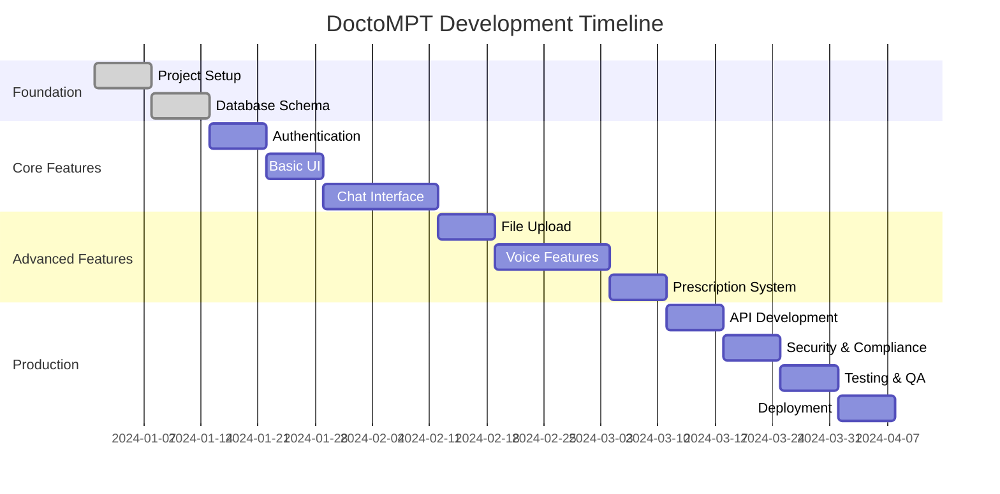

# DoctoMPT
> **A comprehensive medical AI platform with specialized models, Perplexity-like UI, and multimodal capabilities**

## 🎯 Project Overview

DoctoMPT is an advanced medical AI platform that leverages Google's Gemini 2.5 Flash model with specialized medical profiles. The platform features a clean Perplexity-inspired interface, supports multiple file types, voice interactions, and provides specialized medical consultations across 7 different specialties.

### Core Features
- 7 specialized medical AI models (cardioMPT, dermatoMPT, pediatricMPT, neuroMPT, gynecoMPT, doctoMPT, pharmaMPT)
- Perplexity-like clean UI/UX
- Multimodal input support (text, images, audio, documents)
- Up to 10 file attachments per conversation
- Live doctor avatar with voice interaction
- Memory-enabled chat sessions
- Prescription generation with pharmaMPT
- Authentication and rate limiting
- HIPAA-compliant data handling

---

## 📋 Development Phases

### **Phase 1: Foundation Setup (Weeks 1-2)**

#### 1.1 Project Initialization
- [ ] Initialize Next.js 14+ project with TypeScript
- [ ] Set up Tailwind CSS and component library (shadcn/ui)
- [ ] Configure ESLint, Prettier, and Husky
- [ ] Set up development environment and tooling

```bash
npx create-next-app@latest doctompt --typescript --tailwind --eslint
cd doctompt
npx shadcn-ui@latest init
```

#### 1.2 Backend Infrastructure
- [ ] Set up Supabase project
- [ ] Create database schema (users, chat_sessions, messages, rate_limits)
- [ ] Configure Supabase authentication
- [ ] Set up file storage buckets for medical documents

```sql
-- Database Schema
CREATE TABLE profiles (
  id UUID REFERENCES auth.users(id) PRIMARY KEY,
  full_name TEXT,
  avatar_url TEXT,
  subscription_tier TEXT DEFAULT 'free',
  date_of_birth DATE,
  phone_number TEXT,
  created_at TIMESTAMP DEFAULT NOW(),
  updated_at TIMESTAMP DEFAULT NOW()
);

CREATE TABLE chat_sessions (
  id UUID DEFAULT gen_random_uuid() PRIMARY KEY,
  user_id UUID REFERENCES auth.users(id),
  model_type TEXT NOT NULL,
  title TEXT,
  last_message_at TIMESTAMP DEFAULT NOW(),
  created_at TIMESTAMP DEFAULT NOW()
);

CREATE TABLE messages (
  id UUID DEFAULT gen_random_uuid() PRIMARY KEY,
  session_id UUID REFERENCES chat_sessions(id),
  role TEXT NOT NULL CHECK (role IN ('user', 'assistant')),
  content TEXT NOT NULL,
  attachments JSONB DEFAULT '[]',
  metadata JSONB DEFAULT '{}',
  created_at TIMESTAMP DEFAULT NOW()
);

CREATE TABLE rate_limits (
  user_id UUID REFERENCES auth.users(id) PRIMARY KEY,
  requests_count INTEGER DEFAULT 0,
  requests_limit INTEGER DEFAULT 100,
  reset_time TIMESTAMP DEFAULT NOW() + INTERVAL '1 hour'
);

CREATE TABLE prescriptions (
  id UUID DEFAULT gen_random_uuid() PRIMARY KEY,
  user_id UUID REFERENCES auth.users(id),
  session_id UUID REFERENCES chat_sessions(id),
  medications JSONB NOT NULL,
  instructions TEXT,
  warnings TEXT,
  created_at TIMESTAMP DEFAULT NOW()
);
```

#### 1.3 Environment Configuration
- [ ] Set up environment variables
- [ ] Configure Google AI Studio / Vertex AI access
- [ ] Set up Redis for caching and rate limiting
- [ ] Configure deployment environment (Vercel/Railway)

```env
# Environment Variables
NEXT_PUBLIC_SUPABASE_URL=
NEXT_PUBLIC_SUPABASE_ANON_KEY=
SUPABASE_SERVICE_ROLE_KEY=
GEMINI_API_KEY=
REDIS_URL=
NEXT_PUBLIC_APP_URL=
```

### **Phase 2: Core Authentication & UI (Weeks 3-4)**

#### 2.1 Authentication System
- [ ] Implement Supabase Auth integration
- [ ] Create login/signup components
- [ ] Set up protected routes
- [ ] Implement user profile management
- [ ] Add password reset functionality

#### 2.2 Base UI Components
- [ ] Create Perplexity-inspired layout
- [ ] Build model selector component
- [ ] Implement responsive navigation
- [ ] Add loading states and error boundaries
- [ ] Create reusable UI components

```typescript
// Component Structure
components/
├── ui/               # shadcn/ui components
├── auth/            # Authentication components
├── chat/            # Chat-related components
├── models/          # Model selector and info
├── layout/          # Layout components
└── common/          # Shared components
```

#### 2.3 Medical Model Profiles
- [ ] Define 7 medical model configurations
- [ ] Create model-specific prompts and parameters
- [ ] Implement model switching logic
- [ ] Add model-specific UI theming

### **Phase 3: Chat Functionality (Weeks 5-7)**

#### 3.1 Basic Chat Interface
- [ ] Create chat message components
- [ ] Implement real-time message streaming
- [ ] Add typing indicators
- [ ] Create message history management
- [ ] Implement chat session persistence

#### 3.2 Gemini AI Integration
- [ ] Set up Gemini 2.5 Flash API integration
- [ ] Implement medical model profiles
- [ ] Create prompt engineering for each specialty
- [ ] Add response processing and formatting
- [ ] Implement error handling and fallbacks

```typescript
// Medical Model Configuration
const MEDICAL_PROFILES = {
  doctoMPT: {
    name: "General Physician",
    description: "Comprehensive medical consultations and primary care",
    systemPrompt: `You are Dr. MPT, a compassionate general physician...`,
    color: "#3B82F6",
    icon: "🩺",
    specialties: ["general_medicine", "primary_care", "preventive_medicine"]
  },
  cardioMPT: {
    name: "Cardiologist",
    description: "Heart and cardiovascular system specialist",
    systemPrompt: `You are Dr. Cardio MPT, a specialized cardiologist...`,
    color: "#EF4444",
    icon: "❤️",
    specialties: ["cardiology", "heart_disease", "hypertension"]
  },
  // ... other models
};
```

#### 3.3 Memory and Context Management
- [ ] Implement conversation memory
- [ ] Create context-aware responses
- [ ] Add conversation summarization
- [ ] Implement long-term user preferences

### **Phase 4: File Upload & Multimodal Features (Weeks 8-9)**

#### 4.1 File Upload System
- [ ] Implement drag-and-drop file upload
- [ ] Support multiple file types (images, PDFs, audio)
- [ ] Add 10-file attachment limit
- [ ] Create file preview components
- [ ] Implement file compression and optimization

#### 4.2 Multimodal Processing
- [ ] Integrate Gemini Vision for image analysis
- [ ] Add audio processing capabilities
- [ ] Implement PDF text extraction
- [ ] Create handwritten prescription recognition
- [ ] Add medical report parsing

```typescript
// File Upload Configuration
const SUPPORTED_FILE_TYPES = {
  images: ['.png', '.jpg', '.jpeg', '.webp'],
  documents: ['.pdf', '.doc', '.docx'],
  audio: ['.mp3', '.wav', '.m4a', '.ogg']
};

const MAX_FILE_SIZE = 10 * 1024 * 1024; // 10MB
const MAX_ATTACHMENTS = 10;
```

### **Phase 5: Voice Features & Doctor Avatar (Weeks 10-12)**

#### 5.1 Voice Integration
- [ ] Implement Web Speech API
- [ ] Add voice-to-text functionality
- [ ] Integrate Gemini voice capabilities
- [ ] Create text-to-speech responses
- [ ] Add voice conversation mode

#### 5.2 Live Doctor Avatar
- [ ] Create animated doctor avatar
- [ ] Implement real-time voice interaction
- [ ] Add model-specific avatar appearances
- [ ] Create conversation state indicators
- [ ] Add avatar personality traits per model

#### 5.3 Advanced Voice Features
- [ ] Implement continuous conversation mode
- [ ] Add voice command recognition
- [ ] Create natural conversation flow
- [ ] Implement voice-based file upload
- [ ] Add multilingual voice support

### **Phase 6: Prescription System & PharmaMPT (Weeks 13-14)**

#### 6.1 PharmaMPT Development
- [ ] Create specialized pharmacy model
- [ ] Build medication database integration
- [ ] Implement drug interaction checking
- [ ] Add dosage calculation logic
- [ ] Create prescription formatting

#### 6.2 Prescription Generation
- [ ] Build prescription templates
- [ ] Implement medication suggestions
- [ ] Add drug interaction warnings
- [ ] Create dosage and timing recommendations
- [ ] Generate printable prescriptions

```typescript
// Prescription Structure
interface Prescription {
  id: string;
  patientInfo: {
    name: string;
    age: number;
    weight?: number;
    allergies: string[];
  };
  medications: Array<{
    name: string;
    genericName: string;
    dosage: string;
    frequency: string;
    duration: string;
    instructions: string;
    warnings: string[];
  }>;
  diagnosis: string;
  doctorNotes: string;
  followUp: string;
  createdAt: Date;
}
```

### **Phase 7: Backend API & Rate Limiting (Weeks 15-16)**

#### 7.1 API Development
- [ ] Create RESTful API endpoints
- [ ] Implement GraphQL for complex queries
- [ ] Add API documentation (Swagger/OpenAPI)
- [ ] Create webhook handlers
- [ ] Implement API versioning

#### 7.2 Rate Limiting & Security
- [ ] Implement Redis-based rate limiting
- [ ] Add request throttling
- [ ] Create user tier management
- [ ] Implement API key authentication
- [ ] Add request logging and monitoring

#### 7.3 Data Management
- [ ] Implement data backup strategies
- [ ] Create data export functionality
- [ ] Add data retention policies
- [ ] Implement GDPR compliance features
- [ ] Create audit logging system

### **Phase 8: Security & Compliance (Weeks 17-18)**

#### 8.1 HIPAA Compliance
- [ ] Implement end-to-end encryption
- [ ] Add data access controls
- [ ] Create audit trails
- [ ] Implement secure data deletion
- [ ] Add compliance reporting

#### 8.2 Security Hardening
- [ ] Implement input validation and sanitization
- [ ] Add XSS and CSRF protection
- [ ] Create secure file upload handling
- [ ] Implement content security policies
- [ ] Add penetration testing

#### 8.3 Privacy & Legal
- [ ] Create privacy policy and terms of service
- [ ] Add medical disclaimers
- [ ] Implement consent management
- [ ] Create data processing agreements
- [ ] Add age verification for pediatric users

### **Phase 9: Testing & Quality Assurance (Weeks 19-20)**

#### 9.1 Automated Testing
- [ ] Unit tests for all components
- [ ] Integration tests for API endpoints
- [ ] End-to-end testing with Playwright
- [ ] Performance testing and optimization
- [ ] Security testing and vulnerability assessment

#### 9.2 Medical Accuracy Testing
- [ ] Test medical model responses
- [ ] Validate prescription generation
- [ ] Test multimodal input processing
- [ ] Verify medical terminology accuracy
- [ ] Conduct user acceptance testing

#### 9.3 Performance Optimization
- [ ] Optimize API response times
- [ ] Implement caching strategies
- [ ] Optimize file upload/download
- [ ] Reduce bundle sizes
- [ ] Implement lazy loading

### **Phase 10: Deployment & Monitoring (Weeks 21-22)**

#### 10.1 Production Deployment
- [ ] Set up CI/CD pipelines
- [ ] Configure production environment
- [ ] Implement blue-green deployment
- [ ] Set up SSL certificates
- [ ] Configure CDN and load balancing

#### 10.2 Monitoring & Analytics
- [ ] Implement application monitoring
- [ ] Set up error tracking (Sentry)
- [ ] Add user analytics
- [ ] Create performance dashboards
- [ ] Implement health checks

#### 10.3 Documentation
- [ ] Create user documentation
- [ ] Write API documentation
- [ ] Develop troubleshooting guides
- [ ] Create video tutorials
- [ ] Build knowledge base

---

## 🛠 Technical Stack

### Frontend
- **Framework**: Next.js 14+ with TypeScript
- **Styling**: Tailwind CSS + shadcn/ui
- **State Management**: Zustand
- **File Upload**: React Dropzone
- **Voice**: Web Speech API
- **Charts**: Recharts
- **Icons**: Lucide React

### Backend
- **Database**: Supabase (PostgreSQL)
- **Authentication**: Supabase Auth
- **Storage**: Supabase Storage
- **Cache**: Redis
- **API**: Next.js API Routes
- **AI**: Google Gemini 2.5 Flash

### DevOps & Tools
- **Hosting**: Vercel
- **CI/CD**: GitHub Actions
- **Monitoring**: Vercel Analytics + Sentry
- **Testing**: Jest + Playwright
- **Documentation**: Docusaurus

---

## 📊 Project Timeline



---

## 💰 Budget Estimation

### Development Costs
- **Developer Time**: 22 weeks × $50/hour × 40 hours = $44,000
- **UI/UX Design**: $5,000
- **Medical Consultation**: $3,000
- **Legal & Compliance**: $5,000

### Infrastructure Costs (Monthly)
- **Supabase Pro**: $25/month
- **Vercel Pro**: $20/month
- **Redis Cloud**: $30/month
- **Gemini API**: $200-500/month (usage-based)
- **Domain & SSL**: $20/year

### Total Estimated Cost
- **Initial Development**: ~$57,000
- **Monthly Operating**: ~$275-575

---

## 🚀 Launch Strategy

### Beta Phase
1. **Closed Beta** (50 medical professionals)
2. **Open Beta** (500 general users)
3. **Feedback Integration** (2 weeks)
4. **Security Audit** (1 week)

### Marketing
- Medical professional outreach
- Healthcare conference presentations
- Content marketing (medical blogs)
- Social media campaigns
- Influencer partnerships (doctors)

### Success Metrics
- **User Acquisition**: 1,000 users in first month
- **Engagement**: 70% weekly active users
- **Accuracy**: 95% positive feedback on medical advice
- **Performance**: <2s response time
- **Uptime**: 99.9% availability

---

## 🔄 Future Enhancements

### Short-term (3-6 months)
- [ ] Mobile app development (React Native)
- [ ] Telemedicine video integration
- [ ] Insurance integration
- [ ] Multi-language support
- [ ] Advanced analytics dashboard

### Long-term (6-12 months)
- [ ] Custom model training
- [ ] Wearable device integration
- [ ] Hospital system integration
- [ ] AI-powered diagnostics
- [ ] Blockchain for medical records

### Advanced Features
- [ ] 3D medical visualization
- [ ] AR/VR consultation rooms
- [ ] IoT device integration
- [ ] Predictive health analytics
- [ ] Research data contribution

---

## 📋 Development Checklist

### Pre-Development
- [ ] Market research completed
- [ ] Technical architecture finalized
- [ ] Team assembled
- [ ] Legal framework established
- [ ] Funding secured

### Development Milestones
- [ ] MVP completed (Phase 1-3)
- [ ] Beta version ready (Phase 4-6)
- [ ] Production version (Phase 7-9)
- [ ] Launch ready (Phase 10)

### Launch Preparation
- [ ] Security audit passed
- [ ] HIPAA compliance verified
- [ ] User testing completed
- [ ] Documentation finalized
- [ ] Support system ready

---

## 📞 Support & Maintenance

### Ongoing Support
- **24/7 System monitoring**
- **Regular security updates**
- **Monthly feature releases**
- **Quarterly compliance audits**
- **Annual penetration testing**

### Maintenance Schedule
- **Daily**: System health checks
- **Weekly**: Performance optimization
- **Monthly**: Security patches
- **Quarterly**: Feature updates
- **Annually**: Major version releases

---

*This development plan serves as a comprehensive roadmap for building DoctoMPT. Adjust timelines and priorities based on available resources and market demands.*
